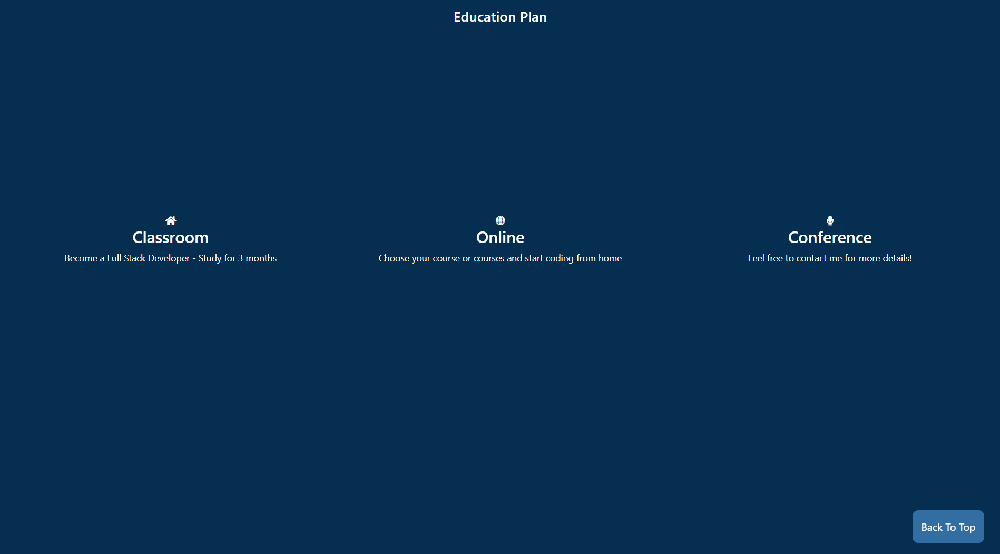
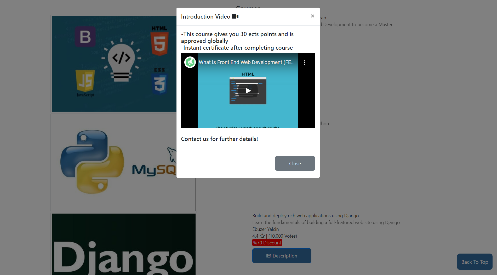
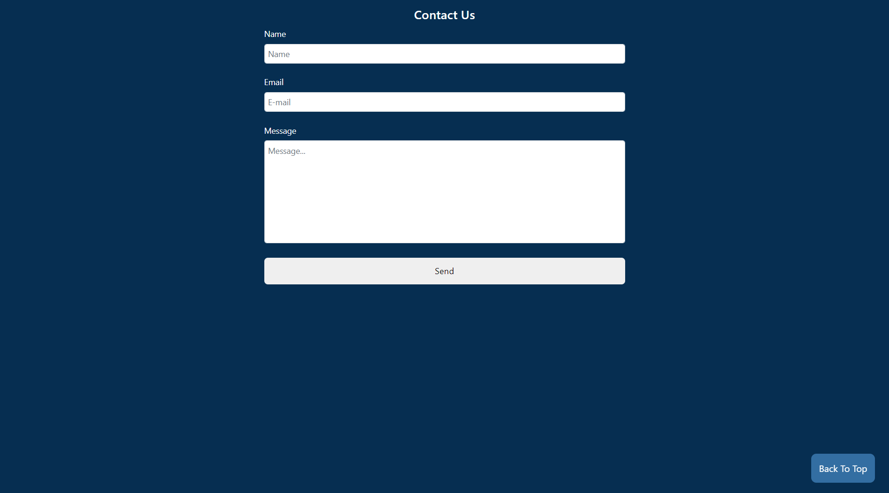
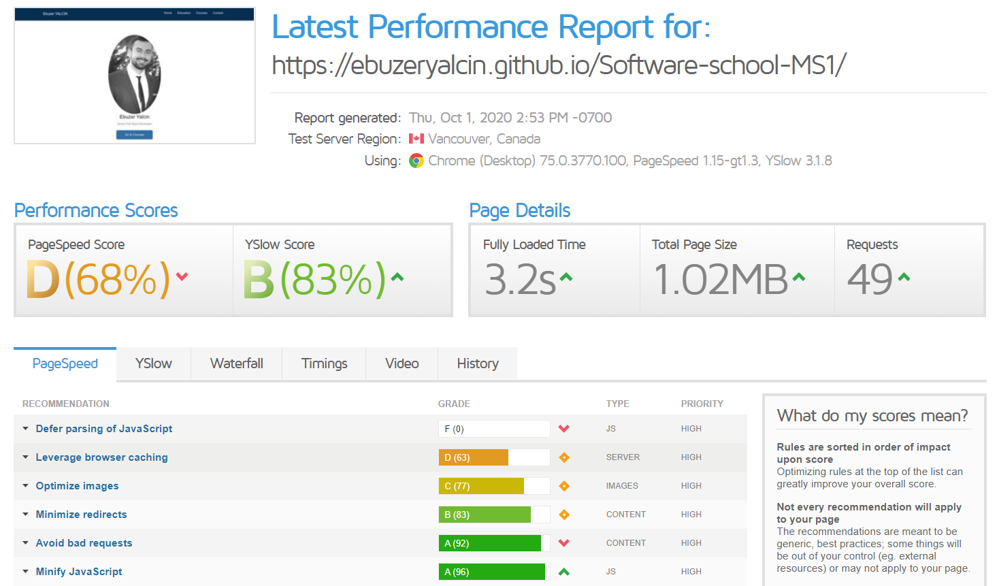
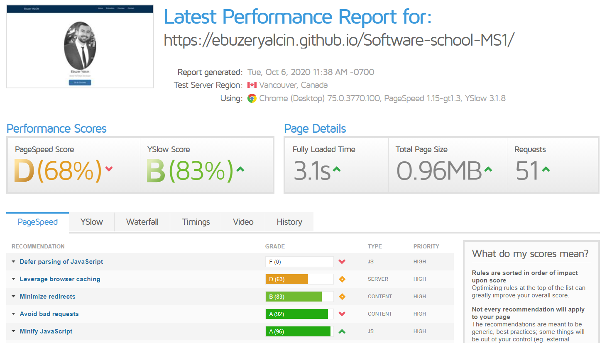

  

# Content 
1. [Introduction](#introduction)
2. [UX](#ux)
3. [Wireframe](#wireframe)
4. [Visual Identity](#visualidentity)    
5. [Site Overview](#siteoverview)
6. [User Stories](#userstories)
7. [Testing](#testing)
8. [Deployment](#deployment)
9. [Code Validation](#codevalidation)
10. [Technologies](#technologies)
11. [Media](#media)
9. [Acknowledgements and thanks](#acknowledgements)

## Introduction 

Software School is an education and mentoring business that offers courses to study in classrooms and online. And conferences is also offered at, for example, trade fairs and companies for skills development.
It was created by a student who studies at the Code Institute and who has ambitions to become a Software Developer.
The content creator knows how important it is to study in the right way and in a flexible environment when needed.

*This site has been created for a school business project and for the exercise purposes. 
This is my first project for the Code Institute Diploma in Full Stack Development.*

## UX 

My goal was to have an intuitive, professional and stylish website. Since all content is on one page, the main function is to easily
access the sections and navigate to the contact form, to contact the content creator. The navigation bar is looking simple and clean, and takes you to different parts of the page in one click.
The appearance of the page looks the same from top to bottom.

- **Home section:**

The design of the Home section is simple and gives a bright introduction of who the person on the front of this business is. 
The background is clean white which makes the portrait, name and title stand out. 
There is also a "Go to Courses" button, the goal is to showcase the offered courses and to make it easier navigationg to the courses section. 

- **Education section:**

This section is simple and clear. There are two different methods to study. Either you study in a classroom or online. 
In classrooms you study for three months and when studying online there is no time limit. The business also offers conferences, 
for example, speech can be kept for training and general understanding of what programmers do.

- **Courses section:**

In this section, responsive layout is achieved using grids. The first course contains languages for learning Front-End Development. 
The second course contains Python and MySql and the third course is about Django. 
Each course has its own Modal pop-up which opens when you click on the "Description" button. 
The Modal pop-up contains information about how many ects points the course gives and that you get a certificate immediately. Each Modal also contains an introductory clip. 
The clips have been added from Youtube using embed links.There is also information about the tutor, what rating the course has received and special discounts. 

- **Contact section:**

The contact section follows the theme of Bootstrap horizontal grid system, which includes booking forms for contacting the school. 
Contact information includes name, email address and a message input. By filling out the form, and submitting it by clicking send button 
target attribute is received at a blank page with information needed.

- **Footer:**

I divided my footer section into two parts. On one part I wanted to add a small presentation about the mentor / tutor. 
After the short presentation, there is contact information, telephone number and email address for the school. 
Then there are also buttons that take us to social media. The second part is Quick Links, by selecting a button you are 
taken directly to a specific section, which makes the user-friendliness better and the navigation much easier.

The total size of the images was shown to be large, which means that the page loads more slowly. I used [tinypng.com](https://tinypng.com/) to compress the file sizes.
The overall reduction in image file sizes decreased by 41% (70 KB).

## Wireframe 

My wireframe was designed using [Moqups Online App](https://moqups.com/)
I created one wireframe for the html page, the desktop view. My plan was that the page would look as similar 
as possible in the desktop, tablet and mobile versions. 

* Below is a link to my wireframe:

[Wireframe Software-school-MS1](https://app.moqups.com/9m58TR1mq0/view/page/a9bb1465e)

## Visual Identity 

Visual identity
I wanted to give the page a professional character, and to give that feeling I used a stylish look on the whole page.
On the website itself, I chose colors as support so that it became easier to visually distinguish and separate areas. 
The choice of colors, the appearance of the buttons makes it easier for users to distinguish parts of the page and it is easier 
to figure out what different parts of the page mean, which leads to continuity. For example, the percentage and color choice of 
discounts attracts the eye and is a way to get users interested. Another example, the Description buttons on the courses have the 
same look, the hover behavior is the same and one click takes us to the Modal pop-up. By clicking on one of the description buttons 
and exiting it, the user understands that the other description buttons also contain information. It gives depth to the page and users 
stay longer on the page, which increases the chance that people will go ahead and contact the business.

Another way in which I used color to combine things around the site was the hovering behavior with links. I set all links to change 
to the same light green color when you hover on / click on and also the modal buttons. When it comes to the navigation links, 
in addition to the color, I also set these to briefly switch to italics for extra effect.

The visual identity page is consistent. By using the same design, from blue to white and so on throughout the page, the visuals continue 
from the top of the page all the way down. In the footer section, I chose to use a gray color to distinguish it from previous parts of the page.
There is also a Back To Top button throughout the page to make it easy to navigate to top of the page. 

### Site overview 

Series of images of the site is shown below:

## User Stories 

**Users:**

- As a user, I'd like to find information that online courses is available.
- As a user, I'd like to find information that classroom courses is available.
- As a user, I'd like to know more about courses the content creator offers.
- As a user, I'd like to know that the content creator also gives conferences.
- As a user, I'd like to know that the content creator have an experienced career in programming, so I can trust his tutoring/mentoring. 
- As a user, I'd like to see the location?(classroom, add classroom online in description) 
- As a user, I'd like to call but also contact them by writing a message or mail. 
- As a user, I'd like to easily connect with the content creator. 
- As a user, I'd like to know that the content creator uses social media platforms. 

**Software School content creator:**

- As a content creator, I'd like to attrect people to my website so they can learn programming. 
- As a content creator, I'd like to promote the school with a clean and proffessional page. 
- As a content creator, I'd like to promote different education plans that I offer to people.
- As a content creator, I'd like to promote the courses I offer online and in classrooms. 
- As a content creator, I'd like to gain trust of potential customers by having a noticible and ideal website with straightforward information about what courses I offer.
- As a content creator, I want show that people can trust my services by clearly informing that I am a Senior Full Stack Developer and by having an "About me" part on the Footer section.
- As a content creator, I'd like for potential customers to have a very clear idea of all the services I offer and pricing,
as well as the areas covered. 
- As a content creator, I'd like to show people that I am an active social media user by inserting buttons on the Footer section.
- As a content creator, I add contact information on several parts of the page to show that it is easy to approach me.

## Testing 

I tested my website using GTMetrix, [GTmetrix](https://gtmetrix.com/reports/ebuzeryalcin.github.io/2V5DMiqr). 
Below there is two screenshots showing my results:
Page speed score was 94% and the time to fully load the site was 1.7s.

GTMetrix detected and recommended some speed fixes at the page as shown below. To optimize images I used TinyPNG to compress my images. 

I got bad results on "defer parsing javascript" and "Leverage browser caching". Everything else looks great but there is not much I can do to 
fix these two recommendations. My latest results is shown below:

**Testing/Demo**

While I was testing carefully the overall look and responsiveness of my site, there occured some issues on the page. I have listed some changes and fixes down below:

- During the project I came across errors in padding. The appearance of the computer screen usually looked good while other screen sizes 
such as tablet and mobile versions encountered errors. After I added the Bootstrap grid to the courses section, I discovered a white line 
on the right side of the web page. After a long investigation, I found a thread that the error can occur when the padding on a css style 
rule differs from all others. I went through all my twenty padding styles and finally found the error on the padding in the Footer section.

- Another problem I was spending time on was that I could not remove text decoration on the buttons in the Navbar. I looked through my 
style.css and tried to use the same style from other sections but the underline on the buttons in the Navbar when I hovered over did 
not disappear. Finally I solved the error by adding a text decoration, none rule in the hover selector.

- During a test on my mobile phone, I encountered an error on the background color in the send button on the contact section. I was 
surprised that I never encountered the error before when, for example, I used google chrome inspect to check the mobile version of the 
page. On my computer, the background color was white, but when I tested the page on my mobile phone, the background color was dark blue. 
I then added white to the background color rule on style.css.

- A recurrent problem/bug which I have not managed to resolve satisfactorily is the height of the home page (index html). I really wanted the background photo to take up the full height of the screen and absorb the text from the footer and this works, but it then also creates a vertical scrollbar due to overflow.
All my attempts to fix this have failed because if I resolved the overflow problem I then ended up with an issue with the footer icons moving around and/or a white band at the bottom of the page. In the end, I figured that it caused the least disruption to the site to leave the overflow as it was.

- I have tested the code on  different browsers (Chrome, Firefox, Edge, Opera, Safari) and on different devices such as mobile, tablet, laptop and large desktop.

In other instances, I have simply changed things around because I thought that they looked nicer or worked better.

## Deployment 

**Deployment**

This website has been deployed to GitHub Pages as [Software-school-MS1](https://ebuzeryalcin.github.io/Software-school-MS1/).

### Code validation 

The code has been runned through [W3C Markup Validation Service](https://validator.w3.org) and the [CSS Validation Service](https://jigsaw.w3.org/css-validator).

W3C, for HTML, gave me three errors about the attributes in the iframes I used to embed Youtube videos in my Modals. I found that some attributes was not necessary and deleted them. 
Two warnings appeared which can be considered as minor issues. The first is that I used two consecutive hyphens. 
The second one is a class I used for h1 for style, h1 is always treated as top-level heading. 
For CSS I got warning about Font family, about vendor extensions are proprietary code, as such it will always be invalid and warning about using same color rules in different styles.

The latest results of the validation is below:

## Technologies 

Primarily I have used the technologies [HTML5](https://en.wikipedia.org/wiki/HTML5) and [CSS3](https://en.wikipedia.org/wiki/CSS) to build, in addition to these, I have also used these below:

- [Gitpod](https://www.gitpod.io)
    I have coded through Gitpod, I figured it would go first in the list. All code was written in Gitpod, the workspace is located here. 

- [GitHub](https://www.github.com)
    Used to hosting and deploying the project. 

- [Bootstrap](https://getbootstrap.com)
    I used the grid system, Modal, navbar and so on from Bootstrap. I have relied heavily on Bootstrap elements although I have on many occasions modified it for styling purposes.

- [FontAwesome](https://fontawesome.com)
    Used for their great icons, which I have used on most if not all my pages. I used it a lot and having a lot of modifications in the code.

- [Cloudflare](https://www.cloudflare.com) 
    This is only used for scripts. 

- [Google Fonts](https://fonts.google.com/) 
    Used for fonts. 

- [Code Beautify CSS beautifier](https://codebeautify.org)
    To make CSS look nicer and tidier.

- [Beautify Tools HTML beautifier](http://beautifytools.com/html-beautifier.php)
    To make HTML tidier.

- [W3C Markup Validation Service](https://validator.w3.org)
    To check the HTML code.
    
- [CSS Validation Service](https://jigsaw.w3.org/css-validator)
    To check the CSS code.

- [Chrome Developer Tools](https://developers.google.com/web/tools/chrome-devtools)
    Used it all the time, which was very important to make quick changes and detect errors.

## Media 

I have taken advantage of several useful resources for images and my logo. Please see below:

- [Free Logo Design](https://www.freelogodesign.org/) 
    Even though the real logo is the name of the content creator I wanted to create a logo for the readme file. 

- [Google images](https://www.google.com/imghp) 
    For some of the used images.

- [Font Awesome](https://fontawesome.com/6?next=%2Fstart) 
    Icons I used on this project.

- [Youtube](http://youtube.com/) 
    For the videos I embedded in my Modals. 

- [Favicon](https://www.favicon.io)
    For the customized favicon I used. 